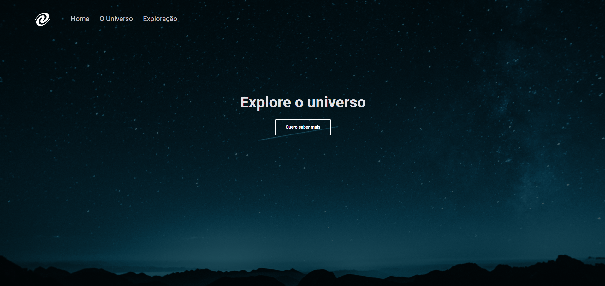

<h1 align="center"> 👩‍🚀 Explore the Universe 🚀 </h1>

This project was developed in Stage 06 of Explorer, implementing a SPA with routes in JavaScript!

  

 

# 🔨 What was covered in this challenge:

 - SPA concepts;
 - Route mapping;
 - Asynchronous and promises;
 - Object orientation;
 - Classes and much more.

 

# 🚀 Technologies

The following tools were used to build the project:

 - HTML
 - CSS
 - JavaScript
 - Node.js
   
 

# 💻 You can access here [aqui](https://universoexplorado.vercel.app/)

 made with ❤ by <a href="https://www.instagram.com/saulochristian_/" target="_blank">@saulochristian</a>

